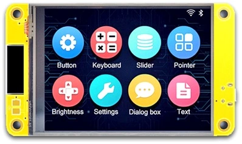

# esp322432s028-tinygo

TinyGo example for esp322432s028 yellow board



## Running

```bash
go mod tidy
tinygo flash -target esp32 --monitor main.go
```
## Useful links

- [TinyGo](https://tinygo.org/)
- [Great article on this board](https://macsbug.wordpress.com/2022/08/17/esp32-2432s028/)
